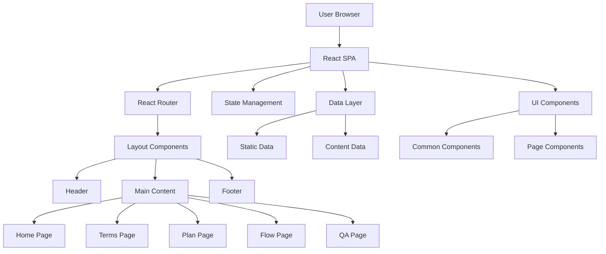

# REI哥日本不動產X買房知識百科書 - アーキテクチャ設計書

## 1. プロジェクト概要
台湾人向け日本不動産購入支援サイトの全体アーキテクチャ設計

### 1.1 基本仕様
- **対象ユーザー**: 台湾人（日本不動産購入検討者）
- **言語**: 繁体字中国語
- **フレームワーク**: React 18+
- **ビルドツール**: Vite
- **サイト名**: REI哥日本不動產X買房知識百科書

## 2. システムアーキテクチャ

### 2.1 全体構成図



### 2.2 技術スタック
- **Frontend**: React 18+ with Hooks
- **Build Tool**: Vite 4+
- **Routing**: React Router DOM v6
- **Styling**: CSS Modules / Styled Components
- **State Management**: React Context API
- **Deployment**: Static Hosting (Vercel/Netlify)

## 3. ディレクトリ構造

```
rei-tw-realestate/
├── public/
│   ├── index.html
│   ├── favicon.ico
│   └── assets/
│       ├── images/
│       └── icons/
├── src/
│   ├── components/
│   │   ├── common/
│   │   │   ├── Header.jsx
│   │   │   ├── Footer.jsx
│   │   │   ├── Navigation.jsx
│   │   │   └── Layout.jsx
│   │   └── ui/
│   │       ├── Button.jsx
│   │       ├── Card.jsx
│   │       └── Modal.jsx
│   ├── pages/
│   │   ├── Home.jsx
│   │   ├── Terms.jsx
│   │   ├── Plan.jsx
│   │   ├── Flow.jsx
│   │   └── Qa.jsx
│   ├── data/
│   │   ├── propertyTypes.js
│   │   ├── rightsTypes.js
│   │   ├── flowSteps.js
│   │   └── qaData.js
│   ├── styles/
│   │   ├── globals.css
│   │   ├── variables.css
│   │   └── components/
│   ├── utils/
│   │   └── constants.js
│   ├── App.jsx
│   └── main.jsx
├── package.json
├── vite.config.js
└── README.md
```

## 4. コア機能設計

### 4.1 ナビゲーション構造
- **ヘッダー**: 固定ナビゲーション
  - サイト名（左上）
  - メニュー項目（水平配置）
- **フッター**: 権利表記（twsho）

### 4.2 レスポンシブ設計
- **デスクトップ**: 1200px以上
- **タブレット**: 768px - 1199px
- **モバイル**: 767px以下

### 4.3 多言語対応
- 繁体字中国語をベース言語とする
- 将来的な多言語対応を考慮した構造

## 5. データ管理戦略

### 5.1 静的データ構造
```javascript
// propertyTypes.js
export const propertyTypes = {
  apartment: {
    name: "アパート",
    chineseName: "公寓（木造、輕鋼構公寓）",
    description: "通常指木造或輕鋼骨結構建造的低層集合住宅...",
    features: [...]
  },
  // その他の物件タイプ
}

// rightsTypes.js
export const rightsTypes = {
  ownership: {
    name: "所有権",
    chineseName: "所有權",
    description: "最完整的權利...",
    details: [...]
  },
  // その他の権利タイプ
}
```

### 5.2 コンテンツ管理
- 静的JSONファイルでコンテンツ管理
- 将来的なCMS統合を考慮した構造

## 6. パフォーマンス最適化

### 6.1 バンドル最適化
- コード分割（React.lazy）
- 動的インポート
- Tree shaking

### 6.2 リソース最適化
- 画像の最適化（WebP対応）
- CSS/JSの最小化
- キャッシュ戦略

## 7. SEO・アクセシビリティ

### 7.1 SEO対策
- メタタグの適切な設定
- 構造化データの実装
- サイトマップの生成

### 7.2 アクセシビリティ
- WCAG 2.1 AA準拠
- セマンティックHTML
- キーボードナビゲーション対応

## 8. セキュリティ考慮事項

### 8.1 フロントエンド セキュリティ
- XSS対策
- HTTPS強制
- CSP（Content Security Policy）

### 8.2 データ保護
- 個人情報の適切な取り扱い
- Cookie使用の透明性

## 9. デプロイメント戦略

### 9.1 CI/CD パイプライン
- GitHub Actions
- 自動テスト
- 自動デプロイ

### 9.2 ホスティング
- 静的サイトホスティング（Vercel/Netlify）
- CDN活用
- ドメイン設定

## 10. 監視・メンテナンス

### 10.1 パフォーマンス監視
- Core Web Vitals
- ユーザー体験指標

### 10.2 エラー監視
- エラートラッキング
- ユーザビリティテスト