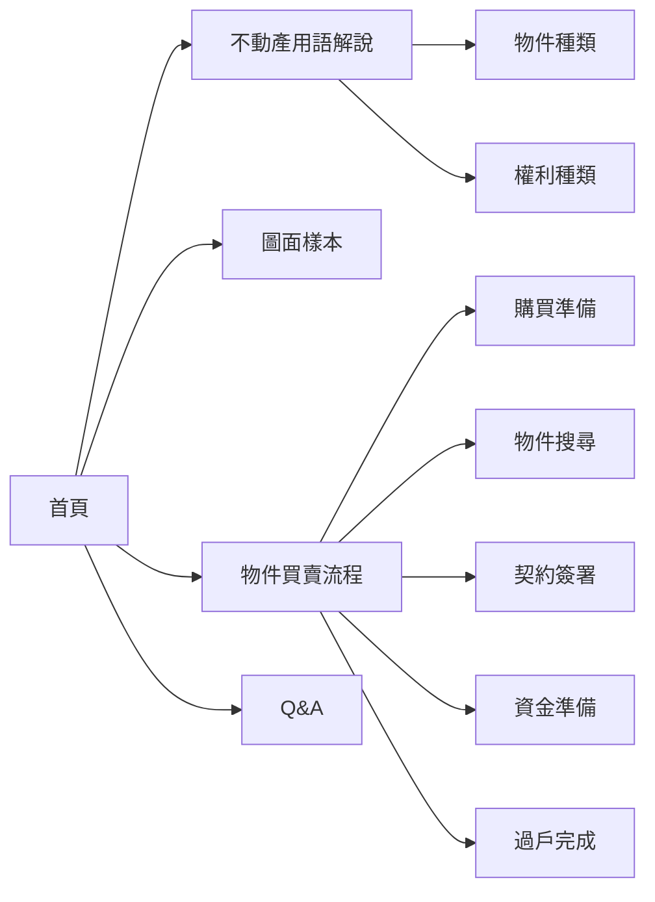

# REI哥日本不動產X買房知識百科書 - コンポーネント設計書

## 1. ルーティング設計

### 1.1 ルート構成
```javascript
// App.jsx での基本ルーティング設計
import { BrowserRouter as Router, Routes, Route } from 'react-router-dom';
import Layout from './components/common/Layout';
import Home from './pages/Home';
import Terms from './pages/Terms';
import Plan from './pages/Plan';
import Flow from './pages/Flow';
import Qa from './pages/Qa';

const routeConfig = [
  { path: '/', element: Home, title: '首頁' },
  { path: '/terms', element: Terms, title: '不動產用語解說' },
  { path: '/plans', element: Plan, title: '圖面樣本' },
  { path: '/flow', element: Flow, title: '物件買賣流程' },
  { path: '/qa', element: Qa, title: 'Q&A' }
];
```

### 1.2 ナビゲーション構造


## 2. コンポーネント階層設計

### 2.1 全体構成
```
App
├── Layout
│   ├── Header
│   │   ├── Logo
│   │   └── Navigation
│   ├── Main
│   │   └── [Page Components]
│   └── Footer
└── [Utility Components]
```

### 2.2 共通コンポーネント（/src/components/common/）

#### 2.2.1 Layout.jsx
```javascript
// レイアウト設計仕様
const Layout = ({ children }) => {
  return (
    <div className="layout">
      <Header />
      <main className="main-content">
        {children}
      </main>
      <Footer />
    </div>
  );
};

// スタイリング仕様
- フレックスボックスレイアウト
- ヘッダー固定、メインコンテンツ可変、フッター下部固定
- レスポンシブ対応
```

#### 2.2.2 Header.jsx
```javascript
// ヘッダー構成要素
const Header = () => {
  return (
    <header className="header">
      <div className="container">
        <Logo />
        <Navigation />
        <MobileMenuToggle /> {/* モバイル用 */}
      </div>
    </header>
  );
};

// 機能仕様
- 固定ヘッダー（sticky position）
- レスポンシブナビゲーション
- モバイルハンバーガーメニュー
```

#### 2.2.3 Navigation.jsx
```javascript
// ナビゲーション設計
const Navigation = () => {
  const navItems = [
    { path: '/', label: '首頁', icon: 'home' },
    { path: '/terms', label: '不動產用語', icon: 'book' },
    { path: '/plans', label: '圖面樣本', icon: 'blueprint' },
    { path: '/flow', label: '買賣流程', icon: 'flow' },
    { path: '/qa', label: 'Q&A', icon: 'question' }
  ];
  
  return (
    <nav className="navigation">
      {navItems.map(item => (
        <NavLink key={item.path} to={item.path}>
          <Icon name={item.icon} />
          {item.label}
        </NavLink>
      ))}
    </nav>
  );
};

// スタイリング仕様
- アクティブ状態の視覚フィードバック
- ホバーエフェクト
- アイコンとテキストの組み合わせ
```

#### 2.2.4 Footer.jsx
```javascript
// フッター設計
const Footer = () => {
  return (
    <footer className="footer">
      <div className="container">
        <p className="copyright">© 2024 twsho. All rights reserved.</p>
        <div className="footer-links">
          <Link to="/privacy">隱私政策</Link>
          <Link to="/terms-of-use">使用條款</Link>
        </div>
      </div>
    </footer>
  );
};
```

### 2.3 UIコンポーネント（/src/components/ui/）

#### 2.3.1 Card.jsx
```javascript
// カードコンポーネント設計
const Card = ({ title, content, image, className, onClick }) => {
  return (
    <div className={`card ${className}`} onClick={onClick}>
      {image && <div className="card-image">{image}</div>}
      <div className="card-content">
        {title && <h3 className="card-title">{title}</h3>}
        <div className="card-body">{content}</div>
      </div>
    </div>
  );
};

// 用途
- 物件タイプ表示
- 権利種類説明
- プロセスステップ表示
- Q&A項目表示
```

#### 2.3.2 Button.jsx
```javascript
// ボタンコンポーネント設計
const Button = ({ 
  variant = 'primary', 
  size = 'medium', 
  disabled = false,
  onClick,
  children 
}) => {
  return (
    <button 
      className={`btn btn-${variant} btn-${size}`}
      disabled={disabled}
      onClick={onClick}
    >
      {children}
    </button>
  );
};

// バリアント
- primary: 主要アクション用
- secondary: 副次アクション用
- outline: アウトライン表示用
- link: リンク風表示用
```

#### 2.3.3 Modal.jsx
```javascript
// モーダルコンポーネント設計
const Modal = ({ isOpen, onClose, title, children }) => {
  return (
    <div className={`modal-overlay ${isOpen ? 'active' : ''}`}>
      <div className="modal-content">
        <div className="modal-header">
          <h2>{title}</h2>
          <button className="close-btn" onClick={onClose}>×</button>
        </div>
        <div className="modal-body">
          {children}
        </div>
      </div>
    </div>
  );
};

// 用途
- 用語詳細表示
- 図面拡大表示
- お問い合わせフォーム
```

## 3. ページコンポーネント設計

### 3.1 Home.jsx
```javascript
// ホームページ構成
const Home = () => {
  return (
    <div className="home-page">
      <HeroSection />
      <IntroductionSection />
      <SNSLinksSection />
      <QuickNavigationSection />
    </div>
  );
};

// セクション構成
- HeroSection: メインビジュアル・キャッチコピー
- IntroductionSection: REI紹介・サイト説明
- SNSLinksSection: Instagram等SNSリンク
- QuickNavigationSection: 主要ページへのクイックアクセス
```

### 3.2 Terms.jsx
```javascript
// 用語解説ページ構成
const Terms = () => {
  const [selectedCategory, setSelectedCategory] = useState('property');
  
  return (
    <div className="terms-page">
      <PageHeader title="不動產用語解說" />
      <CategoryTabs 
        categories={['property', 'rights']}
        selected={selectedCategory}
        onChange={setSelectedCategory}
      />
      <TermsGrid category={selectedCategory} />
    </div>
  );
};

// 機能仕様
- タブ切り替え（物件種類・権利種類）
- グリッドレイアウト
- 詳細モーダル表示
- 検索機能（将来実装）
```

### 3.3 Plan.jsx
```javascript
// 図面サンプルページ構成
const Plan = () => {
  return (
    <div className="plan-page">
      <PageHeader title="圖面樣本" />
      <PlanExplanation />
      <PlanExamples />
      <PlanGlossary />
    </div>
  );
};

// セクション構成
- PlanExplanation: 図面の見方説明
- PlanExamples: サンプル図面表示
- PlanGlossary: 図面用語集
```

### 3.4 Flow.jsx
```javascript
// 買売流程ページ構成
const Flow = () => {
  return (
    <div className="flow-page">
      <PageHeader title="物件買賣流程" />
      <FlowDiagram />
      <FlowSteps />
      <ImportantNotes />
    </div>
  );
};

// セクション構成
- FlowDiagram: フローチャート表示
- FlowSteps: ステップ詳細説明
- ImportantNotes: 重要な注意事項
```

### 3.5 Qa.jsx
```javascript
// Q&Aページ構成
const Qa = () => {
  const [searchTerm, setSearchTerm] = useState('');
  const [selectedCategory, setSelectedCategory] = useState('all');
  
  return (
    <div className="qa-page">
      <PageHeader title="常見問題" />
      <SearchBar value={searchTerm} onChange={setSearchTerm} />
      <CategoryFilter 
        selected={selectedCategory}
        onChange={setSelectedCategory}
      />
      <QaList 
        searchTerm={searchTerm}
        category={selectedCategory}
      />
    </div>
  );
};

// 機能仕様
- 検索機能
- カテゴリフィルタ
- アコーディオン形式のQ&A表示
```

## 4. レスポンシブ設計

### 4.1 ブレークポイント
```css
/* レスポンシブ設計仕様 */
:root {
  --breakpoint-mobile: 768px;
  --breakpoint-tablet: 1024px;
  --breakpoint-desktop: 1200px;
}

/* モバイルファースト設計 */
.navigation {
  /* モバイル用スタイル */
}

@media (min-width: 768px) {
  .navigation {
    /* タブレット用スタイル */
  }
}

@media (min-width: 1024px) {
  .navigation {
    /* デスクトップ用スタイル */
  }
}
```

### 4.2 モバイル対応
- ハンバーガーメニュー実装
- タッチ操作最適化
- フォントサイズ・間隔調整
- スワイプ操作対応（カルーセル等）

## 5. 状態管理設計

### 5.1 Context構造
```javascript
// アプリケーション状態管理
const AppContext = createContext();

const AppProvider = ({ children }) => {
  const [theme, setTheme] = useState('light');
  const [language, setLanguage] = useState('zh-TW');
  const [mobileMenuOpen, setMobileMenuOpen] = useState(false);
  
  const value = {
    theme,
    setTheme,
    language,
    setLanguage,
    mobileMenuOpen,
    setMobileMenuOpen
  };
  
  return (
    <AppContext.Provider value={value}>
      {children}
    </AppContext.Provider>
  );
};
```

### 5.2 コンポーネント間通信
- Props drilling回避のためのContext使用
- カスタムHooksでロジック分離
- イベントハンドリングの統一

## 6. アクセシビリティ設計

### 6.1 セマンティックHTML
```html
<!-- 適切な見出し構造 -->
<main>
  <h1>不動產用語解說</h1>
  <section>
    <h2>物件種類</h2>
    <article>
      <h3>アパート</h3>
    </article>
  </section>
</main>
```

### 6.2 ARIA属性
```javascript
// アクセシビリティ対応例
<button 
  aria-expanded={isOpen}
  aria-controls="mobile-menu"
  aria-label="選單"
>
  ☰
</button>

<nav 
  id="mobile-menu"
  aria-hidden={!isOpen}
>
  {/* ナビゲーション内容 */}
</nav>
```

## 7. パフォーマンス最適化

### 7.1 Code Splitting
```javascript
// 動的インポートによるコード分割
const Terms = lazy(() => import('./pages/Terms'));
const Plan = lazy(() => import('./pages/Plan'));
const Flow = lazy(() => import('./pages/Flow'));
const Qa = lazy(() => import('./pages/Qa'));

// Suspense による読み込み処理
<Suspense fallback={<LoadingSpinner />}>
  <Routes>
    <Route path="/terms" element={<Terms />} />
    {/* その他のルート */}
  </Routes>
</Suspense>
```

### 7.2 メモ化
```javascript
// React.memo による最適化
const ExpensiveComponent = React.memo(({ data }) => {
  return <div>{/* 重い処理を含むコンポーネント */}</div>;
});

// useMemo/useCallback の活用
const MemoizedComponent = () => {
  const expensiveValue = useMemo(() => 
    heavyCalculation(data), [data]
  );
  
  const handleClick = useCallback(() => {
    // イベントハンドラ
  }, [dependency]);
  
  return <div>{/* コンポーネント内容 */}</div>;
};